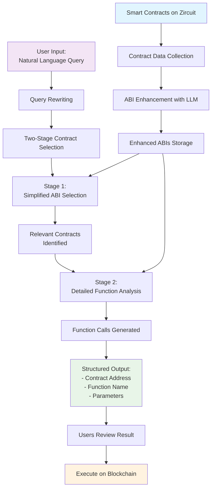

# Zircuit LLM Agent (Powered by Agent-Friendly ABI)

> 🤖 AI smart contract interaction agent for the Zircuit blockchain, powered by agent-friendly ABI

[](https://opensource.org/licenses/MIT)
[](https://www.python.org/downloads/)
[](https://fastapi.tiangolo.com/)
[](https://python-poetry.org/)

## Overview

The Zircuit LLM Agent converts natural language queries into executable smart contract function calls on the Zircuit blockchain. It uses advanced AI models to understand user intent and automatically generates the correct contract interactions.

**Key Features:**
- 🧠 **Natural Language Processing**: Convert human queries to smart contract calls
- ⚡ **Two-Stage Contract Selection**: Efficient contract discovery and function generation
- 🔍 **Smart Contract Analysis**: AI-enhanced ABI processing for better understanding
- 🚀 **FastAPI REST API**: Production-ready API with interactive documentation
- 🧪 **Comprehensive Testing**: 25+ test cases with detailed metrics and reporting

## Quick Start

### 1. Installation

```bash
# Clone the repository
git clone <repository-url>
cd <repository-root>

# Install dependencies
poetry install

# Set up environment variables
cp .env.example .env
# Edit .env with your OpenAI API key
```

For Zircuit contract metadata, please download it from [here](https://drive.google.com/file/d/1cL7eykK7iMsQu7tOplbBmbPcES7PJWaG/view?usp=sharing) and put it under ``./data/zircuit/`` (default path).

### 2. Start the API Server

```bash
# Using the startup script
python start_api.py

# Or directly with uvicorn
uvicorn main:app --reload --host 0.0.0.0 --port 8000
```

### 3. Try It Out

Visit http://localhost:8000/docs for the interactive API documentation, or make a curl request:

```bash
curl -X POST http://localhost:8000/query \
  -H "Content-Type: application/json" \
  -d '{
    "query": "I want to add a new owner to my multisig wallet",
    "max_contracts": 3
  }'
```

## How It Works

The following diagram illustrates how the system works from smart contracts to user interaction:



### Two-Stage Processing

1. **Stage 1**: Quickly identifies relevant contracts using simplified ABIs
2. **Stage 2**: Generates detailed function calls with specific parameters

This approach reduces token usage by 60-80% while improving accuracy and response times.

## API Endpoints

| Endpoint | Method | Description |
|----------|--------|-------------|
| `/query` | POST | **Main endpoint** - Process natural language queries |
| `/query/rewrite` | POST | Rewrite queries for better context |
| `/contracts/select` | POST | Stage 1: Select relevant contracts |
| `/functions/generate` | POST | Stage 2: Generate function calls |
| `/contracts` |	GET	| List all available contracts |
| `/preprocess` | POST | Bulk preprocess contracts to agent-friendly ABIs |
| `/contracts/preprocess` | POST | Preprocess specific contracts by address |
| `/health` | GET | Health check and status |

## Usage Examples

### Basic Query Processing

```python
import requests

response = requests.post("http://localhost:8000/query", json={
    "query": "Transfer 100 USDC tokens to 0x742d35Cc6634C0532925a3b8D4c4c4c4D5C7c8d",
    "max_contracts": 3
})

result = response.json()
print(result["function_calls"])
```

### Two-Stage Workflow

```bash
# Stage 1: Select contracts
curl -X POST http://localhost:8000/contracts/select \
  -d '{"query": "Transfer ERC20 tokens", "max_contracts": 3}'

# Stage 2: Generate functions (using selected contracts)
curl -X POST http://localhost:8000/functions/generate \
  -d '{"query": "Transfer ERC20 tokens", "selected_contracts": ["0x1234..."]}'
```

See `api_examples.py` for more detailed Python examples.

## Configuration

### Environment Variables

Create a `.env` file in the project root:

```env
OPENAI_API_KEY=your-api-key-here
OPENAI_MAX_TOKEN_LENGTH=81920
DEFAULT_MODEL=o3-mini

HOST=0.0.0.0
PORT=8000

CONTRACTS_DATA_PATH=data/zircuit/zircuit_contract_metadata.json
ENHANCED_ABIS_DIR=data/enhanced_abis
```

### Supported Models

- `o3-mini` (default) - Fast and efficient
- `gpt-4` - More capable for complex queries  
- `gpt-3.5-turbo` - Balanced performance
- And any models you want!

## CLI Usage

The agent also supports command-line usage:

```bash
# Preprocess contracts (first-time setup)
python zircuit_agent.py --mode preprocess

# Interactive mode
python zircuit_agent.py --mode interactive

# Single query
python zircuit_agent.py --mode query --query "Add owner to multisig"
```

## Testing

Run the comprehensive test suite:

```bash
# Run all tests
python tests/test_runner.py

# Run specific number of tests
python tests/test_runner.py --max-tests 5

# Run tests matching a pattern
python tests/test_runner.py --filter "bridge"

# Unit tests
python -m pytest tests/test_unit.py -v
```

### Test Coverage

The framework includes test cases covering:
- Bridge operations (deposits, withdrawals)
- ERC20/ERC721 token interactions
- Safe multisig operations
- Uniswap swaps and liquidity
- Advanced DeFi operations

## Project Structure

```
zircuit-api-demo/
├── main.py                    # FastAPI application
├── zircuit_agent.py          # Main agent orchestrator
├── abi_agent/                # Core processing modules
│   ├── abi_decoder.py       # ABI enhancement with AI
│   ├── query_rewriter.py    # Query processing
│   ├── contract_selector.py # Contract selection (Stage 1)
│   └── function_call_generator.py # Function generation (Stage 2)
├── llm_generation/           # LLM model configurations
├── prompt_template/          # AI prompt templates
├── tests/                    # Testing framework
│   ├── test_runner.py       # Test execution
│   ├── test_cases.json      # Test scenarios
│   └── results/             # Test outputs
├── data/
│   ├── zircuit/             # Contract data
│   └── enhanced_abis/       # Generated ABIs
└── docker-compose.yml       # Docker deployment
```

## Deployment

### Docker

```bash
# Development
docker-compose up --build

# Production with nginx
docker-compose --profile production up -d
```

### Manual Deployment

```bash
# Install production dependencies
poetry install --no-dev

# Run with gunicorn
poetry run gunicorn main:app -w 4 -k uvicorn.workers.UvicornWorker --bind 0.0.0.0:8000
```

## Contributing

We welcome contributions! Please see our contribution guidelines:

1. **Fork the repository** and create a feature branch
2. **Write tests** for new functionality
3. **Follow code style** - use `black` and `isort` for formatting
4. **Update documentation** as needed
5. **Submit a pull request** with a clear description

### Development Setup

```bash
# Install development dependencies
poetry install

# Run formatters
black .
isort .

# Run tests
python tests/test_runner.py --max-tests 5
```

### Adding Test Cases

Edit `tests/test_cases.json` to add new test scenarios. Each test case should include:

```json
{
  "test_case_id": "ZRC_TC_NEW",
  "description": "Description of the test case",
  "natural_language_query": "User's natural language input",
  "assumed_contract_address": "0xContractAddress",
  "ground_truth_function_calls": {
    "function_calling": [
      {
        "function_name": "expectedFunction",
        "parameters": {"param1": "value1"},
        "value": "0"
      }
    ]
  }
}
```

## License

This project is licensed under the MIT License - see the [LICENSE](LICENSE) file for details.

## Support


- 🐛 **Issues**: Report bugs via GitHub Issues
- 💬 **Discussions**: Join our community discussions on GitHub
- 📧 **Contact**: Reach out to the team at dev@gud.dev


---
Built with ❤️ for the Zircuit blockchain ecosystem.   
⭐ **Star us on GitHub** if this project helps you!
